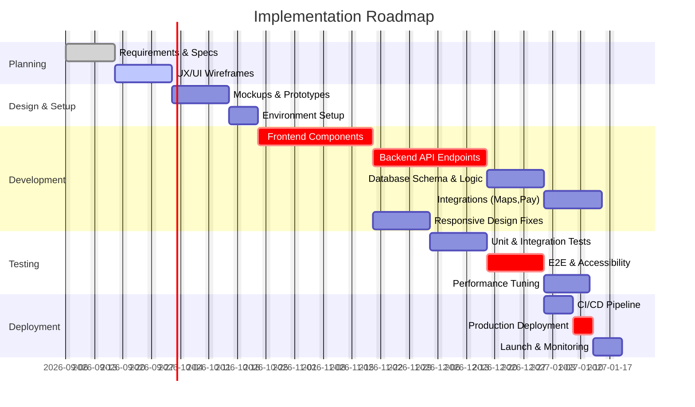

# Executive Summary

The video appears to demo a **digital wedding invitation website** (“Bansuri – Hindu Weddings Invitation”), featuring a cover/monogram, event schedule, photo gallery, RSVP form, and story sections. Recreating this requires careful UI/UX design (mobile-first, accessible, interactive), a modern frontend stack (e.g. React/Angular/Vue with responsive CSS), and a robust backend (APIs for invitations, RSVP, integrations like maps and payment). Data storage could use a relational DB (e.g. PostgreSQL) or a NoSQL document store (e.g. MongoDB) for flexibility. DevOps must cover scalable hosting (cloud or containers), CI/CD pipelines, monitoring and backups. Security (authentication, encryption, OWASP best practices) and privacy (GDPR/CCPA) are critical. Performance and SEO require server-side rendering or pre-rendering so Google can index content, plus optimization of load time. Testing (unit, integration, E2E, load) ensures reliability. We estimate effort via industry benchmarks (e.g. Andersen breakdown: UX/UI 15–20%, core dev 45–55%, QA 15–20%) and can range from tens to hundreds of person-days depending on scope and roles. Below we detail each dimension (with comparisons and citations to primary sources) and conclude with a prioritized implementation roadmap and clarifying questions.

## UI/UX Components and Pages

- **Core pages/sections**: Likely a **single-page, scrollable site** with sections for: (a) **Cover page** (sealed envelope or hero image with monogram, “open” interaction); (b) **Event schedule** (cards for Sagan, Haldi, Wedding, etc with date/time, venues, and map links); (c) **Our Story** (couple’s narrative or timeline); (d) **Photo Gallery** (clickable photos or carousel with masonry layout); (e) **RSVP form** (name, number attending, message); (f) **Thank You** confirmation. There may also be a persistent **navigation header** (logo, menu or back-to-top link) and **footer** with contact/social links. Widgets include buttons (e.g. “RSVP”, “Share”), form fields, map embeds, and a countdown timer (live countdown to wedding). 

- **Interactions**: Users tap to open the envelope, click on event cards to expand details, swipe through photos, and submit the RSVP form. Interactive elements should provide feedback (e.g. button hover states). The interface is likely **mobile-first** (sized for smartphones, given “shared on WhatsApp” claim) and adapts to larger screens (e.g. multi-column layout or larger images).  

- **Responsive behavior**: According to MDN, *“Responsive web design (RWD) is a web design approach to make pages render well on all screen sizes and resolutions while ensuring good usability”*. Thus, layouts should use flexible grids (e.g. CSS Flexbox/Grid), scalable images, and media queries for different breakpoints. Semantic HTML should be used for structure (headings, lists, buttons) so that the site is accessible and SEO-friendly. For accessibility, all functionality must be keyboard-operable (WCAG 2.1 SC 2.1.1), images need `alt` text (WCAG 1.1.1), and form controls require labels. Semantic HTML (e.g. `<button>`, `<nav>`, `<section>`) aids navigation and screen readers.

- **Table** (example UI components):  

  | Page/Section       | Components & Widgets           | Interactions / Notes                                      |
  |--------------------|-------------------------------|-----------------------------------------------------------|
  | Cover / Hero       | Header with names/date, “open envelope” button | Tap to animate envelope opening; auto-play background music. Responsive full-screen image. |
  | Event Schedule     | Cards for each function (title, date/time, venue, map icon) | Cards expand or reveal details on tap. Map icon links to Google Maps.|
  | Photo Gallery      | Masonry grid or carousel of images | Swipe/arrow click to navigate; lightbox enlarge image.   |
  | Our Story          | Text content blocks (timelines) | Scroll into view animations. Text with clear headings.    |
  | RSVP               | Form (text inputs for name, guests, message), Submit button | Real-time validation, submit triggers API call. Confirmation message shown. |
  | Footer / Social    | Contact info, social/share links | “Share” opens WhatsApp/email link to invite link.         |

- **Design principles**: Emphasize visual hierarchy and legibility. Use high-contrast colors, large tap targets, and clean typography. Content should be concise and well-structured for screen readers (provide headings, lists, and ARIA roles). As MDN notes, using *semantic HTML is crucial for accessibility and mobile performance*. All interactive elements (buttons, links) must have focus states and labels. Avoid blocked content (no unsupported pop-ups). 

## Frontend Tech Stack Options

- **Frameworks/Libraries**: Options include **React**, **Angular**, **Vue**, **Svelte**, etc. For example, React is *“a library for building user interfaces”* with a huge ecosystem (JSX, hooks, virtual DOM). Angular is *“an application-design framework and development platform for creating efficient and sophisticated single-page apps”* (full-featured, includes TypeScript, RxJS, and a powerful CLI). Vue is a *“lightweight, progressive alternative”* that is easy to learn and integrates well.  Each has pros/cons (see table below).  

- **Build tools**: Bundlers like Webpack, Rollup, or modern Vite (works with React/Vue) to compile and bundle code. For performance, include **code splitting** (dynamic `import()`) to lazy-load sections. Use Babel or TypeScript transpilation as needed (Angular/TypeScript or Babel for JSX).  

- **State management**: Simple apps may use React Context or component state, but larger needs could use Redux, MobX, Vuex, or NgRx (Angular). If multiple pages share data (RSVP state, user session), a global store is helpful.  

- **Styling/CSS**: Use responsive CSS frameworks or libraries. For example, **Bootstrap** is “a free and open-source CSS framework directed at responsive, mobile-first front-end web development”, providing grid, typography, and components. **Tailwind CSS** is a *“utility-first CSS framework”* offering fine-grained control via utility classes. **Material-UI/Chakra** (React component libraries) or **Angular Material** can speed UI development. Pure CSS (with Flexbox/Grid) or **CSS-in-JS** (styled-components, Emotion) are alternatives.  

- **Accessibility libraries**: Use ARIA utilities or component libraries with built-in a11y (e.g. Reach UI, headless UI) to ensure accessible modals, accordions, etc. Tools like ESLint’s a11y plugin help catch issues.  

- **Internationalization (i18n)**: If multiple languages, use i18n libraries (react-i18next, Angular i18n, Vue I18n). Ensure right-to-left (RTL) support if needed.  

- **CSS and Theming**: Design tokens or CSS variables to switch color schemes (wedding theme could vary). Dark mode can be optional.  

- **Comparison table (Frontend frameworks)**:  

  | Framework  | Advantages                                        | Considerations                       | Citations |
  |------------|---------------------------------------------------|--------------------------------------|-----------|
  | **React**  | Component-based, large ecosystem, React Native for mobile; well-known SEO support via SSR | Requires build tooling (Babel/Webpack), boilerplate (JSX), steep learning curve for Redux | MDN/React docs |
  | **Angular**| Full-featured (TypeScript, CLI, RxJS), strong patterns, Google-backed for enterprises | Verbose, heavy for simple sites, opinionated structure | Angular docs |
  | **Vue**    | Lightweight, incremental adoption, simple syntax, excellent docs | Smaller community than React, but growing; requires build for large apps | Vue guide / perspectives |

- **Accessibility (a11y)**: Implement keyboard navigation (Tab/Shift-Tab support) and screen-reader labels (WCAG). For example, use semantic `<button>` (MDN notes button has built-in keyboard accessibility). Ensure focus order is logical. Use color contrasts meeting WCAG AA. Make dynamic content announcable (e.g. ARIA live regions for RSVP confirmation).  

- **Progressive Web App (PWA)?** Optionally add a manifest and service worker to allow “Add to Home Screen” and offline fallback (basic caching of static content). PWAs can improve load performance and user engagement on mobile.

## Backend Architecture

- **APIs**: A RESTful or GraphQL API to power the frontend. For example, using Node.js (Express/NestJS) or Python (Django/Flask) as server, exposing endpoints like `/api/invitation`, `/api/events`, `/api/photos`, `/api/rsvp`. GraphQL is an option: *“an open-source query language for APIs and a server-side runtime”* that uses a strongly-typed schema, enabling clients to request exactly needed fields. REST is simpler to implement but GraphQL can reduce over-fetching (especially with nested data like events & guests).  

- **Authentication/Authorization**: Likely minimal (invitations might be public links). If users manage invites, implement user accounts with email/password or OAuth (Google/Facebook). Use token-based auth (JWT) or session cookies. Enforce HTTPS. For any admin interface, role-based access control should separate invite creation vs viewing.  

- **Data Models & Logic**: For a wedding invite site, models include **User/Client** (who created the invite), **Invitation** (with metadata: couple names, dates, theme), **Event** (type, time, location, map link), **Photo** (URL, caption), and **RSVP** (guest name, count, message). Business logic will: validate RSVP inputs, send confirmation emails (optional), calculate countdown, and combine user-provided content. If offering payments for premium templates, integrate with a payment gateway (Stripe/PayPal) to process orders. A *“live countdown”* suggests server may send current time or just use client time.  

- **Third-party integrations**: 
  - **Google Maps API** for venue maps (embed via API key). 
  - **Email/SMS**: Optionally use services like SendGrid or Twilio for sharing/invitation messages, or sending RSVP confirmations. 
  - **Payment API**: e.g. Stripe (developers can “accept payments online” via Stripe APIs). 
  - **Analytics**: Google Analytics or similar to track visitor clicks. 
  - **Media storage**: If users upload photos, store in cloud storage (AWS S3, Google Cloud Storage) and serve via CDN. 

- **Architecture diagram**:  
  ```mermaid
  graph TD
    Browser(User) --> Frontend[Frontend App (React/Angular/Vue)]
    Frontend -->|HTTPS JSON API| Backend[API Server (Node/Django/etc.)]
    Backend --> DB[(Database: PostgreSQL/MySQL or MongoDB)]
    Backend --> AuthService[(Authentication Service)]
    Backend --> GoogleMaps[(Google Maps API)]
    Backend --> Payment[(Stripe/PayPal API)]
    Frontend --> CDN[(CDN / Static Assets)]
  ```
  This shows a typical client-server flow. A load balancer or API gateway can sit in front of Backend for scaling/security.  

- **Architecture style**: A **three-tier** or **N-tier** setup: 1) **Frontend layer** (static files, UI); 2) **API/Middleware layer** (handles HTTP requests, auth, business logic); 3) **Data layer** (database, file storage). This separation enables independent scaling (e.g. more front-end instances behind a CDN) and better maintainability.  

- **Microservices vs Monolith**: For a relatively simple site, a monolithic backend (single codebase) suffices. For future growth, components like **auth**, **invitations**, and **payments** could become separate services (e.g. Docker containers or Lambdas). AWS Lambda or Azure Functions could be used for serverless, but ensure cold-start times are acceptable for user experience.  

- **Business logic**: Custom generation of invitation page content (filling templates), sending notifications, and applying any content moderation (e.g. scanning for inappropriate words). Might include back-office tools for admins (not necessarily public), implying additional UI (login, dashboard).  

## Data Storage and Schemas

- **Database choice**: 
  - **Relational (SQL)**: PostgreSQL or MySQL for structured data. Good for joins between Users, Events, RSVPs. E.g. [PostgreSQL](#) is *“a powerful, open source object-relational database system”* with robust features (ACID, foreign keys). It handles complex queries and ensures data integrity (e.g. unique invite links, foreign key constraints). 
  - **NoSQL (Document)**: MongoDB or DynamoDB for flexible schema. MongoDB is *“a general-purpose, document-based, distributed database”*. Useful if invitation structures vary widely. But relational may simplify queries (e.g. list all RSVPs for event). A mixed approach is possible (Postgres + a blob for JSON fields).
  - **Schema examples** (in pseudo-code):  
    ```sql
    Table users (user_id, name, email, password_hash, created_at);
    Table invitations (invite_id, user_id, title, start_date, created_at, theme, music_url);
    Table events (event_id, invite_id, name, datetime, address, map_link);
    Table photos (photo_id, invite_id, url, caption);
    Table rsvps (rsvp_id, invite_id, guest_name, num_attending, message, responded_at);
    ```
    Or as MongoDB collections:
    ```js
    Invitation = {
      _id, userId, title, date, theme, musicUrl,
      events: [{name, datetime, address, mapLink}],
      photos: [{url, caption}],
      rsvps: [{name, guests, message, respondedAt}]
    }
    ```
- **Indexes**: Add indexes on foreign keys (e.g. invite_id in events), and on lookup fields (user email, invite link token). Use UUIDs or hashes for public invite links.  

- **Media storage**: Photos and any uploaded media should be stored in an object store (e.g. Amazon S3 or Google Cloud Storage) with URLs in the DB. Use a CDN for fast delivery (e.g. CloudFront) and generate thumbnails for previews.  

- **Backup and replication**: Set up regular database backups (e.g. automated pg_dump or managed DB snapshots) and enable multi-AZ replicas for high availability. Ensure uploaded files are also backed up/versioned.

## DevOps and Deployment

- **Hosting**: 
  - **Cloud providers**: AWS, Azure, or GCP. For example, AWS Elastic Beanstalk/ECS/EKS for the API, AWS S3+CloudFront for static assets, RDS for SQL DB, and Lambda for serverless. Or use Heroku/Vercel for simplicity (Vercel can host static React sites, with serverless functions). 
  - **Containerization**: Use Docker to containerize the backend (and even the frontend build step). Kubernetes (EKS/GKE/AKS) or AWS Fargate can orchestrate containers if scaling is needed.  
  - **Continuous Integration/Deployment**: A CI/CD pipeline (GitHub Actions, GitLab CI, Jenkins) should build, test, and deploy on commit. IBM notes CI/CD *“streamlines delivery, provides rapid feedback, catches errors early”*. Use infrastructure-as-code (Terraform, AWS CloudFormation) to provision resources.  
- **Scalability**: Design stateless services behind load balancers (AWS ELB) so instances can auto-scale with traffic. Use horizontal scaling for both frontend and backend. Use managed databases with read replicas if high load expected.  
- **Monitoring/Logging**: Implement application logging (ELK stack or AWS CloudWatch Logs) and performance monitoring (Prometheus/Grafana or AWS X-Ray). Alert on errors/latency. Real-time logging helps diagnose bugs.  
- **CDN**: Serve all static assets (CSS/JS/images/music) via a CDN to reduce latency. This also provides TLS termination and DDoS mitigation.  
- **CI/CD Details**: Tools like GitHub Actions or Jenkins will `npm install`, run linters/tests, build the frontend and backend, then deploy artifacts. Automated tests run here. Deploy to staging on each merge, then manual review, then to production.  
- **Security in DevOps**: Include SAST/DAST scans (OWASP ZAP, GitHub CodeQL). Use secret management (AWS Secrets Manager) for keys. Run vulnerability scanning on containers.  
- **Disaster recovery**: Define RTO/RPO. Use DB automated snapshots, and deploy across multiple availability zones. Backups of code and static site are in version control and object storage (versioned S3 buckets).  

## Security, Privacy, and Compliance

- **Authentication & Authorization**: If user accounts exist, implement secure login (hashed passwords, TLS). Use OAuth 2.0 or OpenID Connect if integrating external login. Protect APIs with tokens (JWT with short expiry or session cookies with CSRF tokens). Apply least privilege to database (use separate DB user for API with only necessary CRUD rights).  
- **Encryption**: Enforce HTTPS for all connections (Let’s Encrypt for certs). Encrypt sensitive data at rest (DB encryption or managed DB encryption). Use parameterized queries or ORM to prevent SQL injection.  
- **OWASP Best Practices**: Mitigate common web vulnerabilities: SQL injection (use prepared statements), XSS (escape output or use React’s safe rendering), CSRF tokens for forms, rate-limit requests to APIs, validate all inputs. E.g., [NIST OWASP guide](https://cheatsheetseries.owasp.org/) can be followed.  
- **Privacy (GDPR/CCPA)**: Since this is likely personal event data and maybe contacts, collect only needed personal data (names, emails for RSVP) and obtain consent (e.g. “By submitting, you consent to storing this info”). Provide privacy notice if handling EU/CA data. Allow users to delete their invitation data. Use Google Maps API legally (its terms). Ensure the site is served with appropriate “analytics opt-out” if tracking is used.  
- **Compliance**: If taking payments, ensure PCI-DSS compliance (Stripe is PCI-compliant, just use their checkout iFrame so you avoid handling card data). Use secure cookies (HttpOnly, Secure). Follow best practices in OWASP Top 10 (A1: Injection, A5: Security Misconfig, etc.).  

## Performance and SEO

- **Performance**: Optimize load times via minification (minify JS/CSS), bundling, and gzip/Brotli compression on servers or CDNs. Lazy-load images (and use responsive image formats like WebP/AVIF). Use caching headers (e.g. `Cache-Control`) for static assets. Pre-render or server-side render (SSR) the initial page so users see content quickly – Google notes *“server-side or pre-rendering is still a great idea because it makes your website faster for users and crawlers”*. Use a CDN globally to reduce latency. Optimize Core Web Vitals: fast LCP (Largest Contentful Paint) by inlining critical CSS or using a fast JS framework, low CLS (avoid layout shifts), and good interactivity.  
- **SEO**: Ensure each invite URL has unique `<title>` and `<meta description>` tags (Google recommends this for all pages). Use semantic HTML so Google can parse headings. Include a sitemap or allow crawling. Because content is JavaScript-driven, SSR or prerendering is recommended so crawlers see full content. Google’s guide emphasizes that properly rendering JavaScript sites can be tricky, so prerender key content. Use clean URLs (no hashbangs). Implement `rel="canonical"` to avoid duplicate content issues (as advised by Google).  
- **Analytics & Caching**: Use Google Analytics or similar to track page views, ensuring consent. Employ client-side caching (localStorage or IndexedDB) if reloading data frequently.  

## Testing Strategy

- **Unit Testing**: Write unit tests for both frontend and backend logic. For example, use **Jest** for JavaScript – “a delightful JavaScript Testing Framework” that *“ensures correctness of any JavaScript codebase”*. Write tests for UI components (React Testing Library) and for backend modules (Mocha/Chai or PyTest). Cover edge cases (empty form, long input).  
- **Integration Testing**: Test API endpoints with tools like Postman or automated suites (e.g. Jest/Supertest for Node). Ensure the frontend and backend integrate properly (e.g. a full RSVP submission flow).  
- **End-to-End (E2E) Testing**: Use Cypress or Selenium to simulate user flows: loading the invite, opening envelope, submitting RSVP, verifying UI updates. Tests should run in CI.  
- **Load/Performance Testing**: If expecting high traffic (e.g. thousands of visitors before a wedding), perform load testing with tools like Locust or Apache JMeter to ensure the system scales and to identify bottlenecks.  
- **Accessibility Testing**: Use automated tools (axe-core, Lighthouse) to catch a11y issues. Manual testing with screen reader (NVDA/VoiceOver) to ensure usability.  
- **Security Testing**: Run security scans (OWASP ZAP, or automated vulnerability scanners) as part of testing pipeline. Penetration testing if budget allows.  
- **Test Environments**: Maintain staging and dev environments with production-like data for realistic testing. Use mocking for external APIs during tests.  

## Estimated Effort and Cost Ranges

*(All estimates assume a small custom site without enterprise infrastructure. Actual costs depend on region, developer rates, and project scope.)*

- **Discovery & Planning** (2–4 weeks): Gathering requirements (themes, features), wireframing UI. Roles: Product Owner/PM, UX designer, Business Analyst. (~5–10% of total effort).
- **UX/UI Design** (2–3 weeks): Visual design, high-fidelity mockups, responsive layouts. Roles: UI/UX Designer. (~15–20% effort). Cost: \$5k–\$15k depending on complexity.
- **Core Development** (6–12 weeks): Frontend (building components, responsive CSS, interactions) and Backend (API, DB, auth). Roles: Frontend Dev(s), Backend Dev(s). (~45–55% effort). 
  - *Low estimate*: Small team (2 devs) at moderate pace, ~60 PD (~3 mo). 
  - *Mid*: Larger scope or slower pace, ~100 PD (~5 mo).
  - *High*: Additional features, custom animations, third-party integrations, ~150+ PD.  
  (At \$50–\$100 per developer-hour, 60 PD = \$24k–\$48k; 150 PD = \$60k–\$120k.)
- **Quality Assurance** (2–4 weeks): Writing tests, manual QA, fixing bugs. Roles: QA Engineer(s). (~15–20% effort). Cost: \$5k–\$10k.
- **DevOps/Deployment Setup** (2–3 weeks): CI/CD pipeline, hosting setup, SSL, domain, scaling config. Roles: DevOps Engineer. (~5–8% effort). Cost: \$3k–\$8k.
- **Buffer & Contingency** (10–15%): For unforeseen issues.  
- **Total Timeline**: ~3–6 months from start to launch, depending on resources and parallel work.  
- **Total Cost**: 
  - *Low*: \$50k–\$70k (lean dev, minimal features).
  - *Medium*: \$100k–\$150k (commercial quality, typical rates).
  - *High*: \$200k+ (fast turnaround, multiple designers/devs, extensive customization).
  
These assume Western dev rates; outsourcing or freelancers could reduce cost. Ongoing maintenance (updates, minor features) is extra (often ~20% of dev cost per year).

## Bill of Materials (Libraries, Services, APIs)

- **Frontend**: React (MIT) or Angular (Apache 2) or Vue (MIT); CSS framework (Bootstrap or Tailwind); build tools (Webpack/Vite, Babel, ESLint). ARIA/accessibility libs (e.g. reach-ui).  
- **Backend**: Node.js/Express or Python/Django or Node/NestJS; Auth library (e.g. Passport.js or Django REST framework JWT). Database connectors/ORM (Sequelize/TypeORM or Django ORM). GraphQL server (Apollo) if chosen.  
- **Databases**: PostgreSQL (open-source); MongoDB (open-source) or managed cloud DB (Mongo Atlas, AWS RDS).  
- **Infrastructure**: Cloud provider services (AWS EC2/ECS/Lambda, Azure App Service, etc); S3/Blob Storage; CloudFront/CDN; managed DB instances. Docker (Apache License) for containers; Kubernetes (Apache 2) if used; CI/CD (GitHub Actions or Jenkins free tier).  
- **Third-Party APIs**: Google Maps API (Maps JavaScript API), Stripe or PayPal for payments, Twilio for SMS/WhatsApp (if needed), SendGrid for email. SMS/WhatsApp/SMS APIs cost per message.  
- **Monitoring/Logging**: CloudWatch/Stackdriver (free tiers or pay-as-you-go), Sentry or LogRocket for error tracking (free/OSS or paid plans).  
- **Testing**: Jest (MIT), Cypress (MIT), Postman (free tier) or equivalent.  
- **Licenses/Costs**: Most libs above are OSS. Stripe/PayPal have transaction fees; Google Maps has usage limits (free tier then pay). Domain name (~\$10/year) and SSL (free via Let’s Encrypt).  

## Prioritized Roadmap (Milestones & Deliverables)



Key **milestones**: Design sign-off, dev sprints (frontend/backend), test completion, and production launch. Each sprint ends with code review and demo.  

## Clarifying Questions

After reviewing the video and requirements, some open questions include: 

- **Scope details**: Is user account management needed, or are all invites public links? Should there be an admin panel for managing invitations or RSVPs?  
- **Multilingual support**: Will the site need to support multiple languages (e.g. Hindi/English)?  
- **Traffic expectations**: How many visitors are expected around wedding season (peak load)? This affects scaling needs.  
- **Budget constraints**: Is there a target budget or preferred level of quality?  
- **Platform targets**: Mobile-only or also desktop? Should it be a PWA installable?  
- **Content provision**: Will all content (images, text, music) be provided, or does the system allow user uploads?  
- **Design assets**: Are design assets (logos, themes) fixed, or do we need a theme editor?  
- **Payment/use of monetization**: If charging for templates (as Invifest does), do we integrate payments or handle billing?  
- **Compliance needs**: Any specific legal (other than general privacy) to consider (e.g. regional laws)?  
- **Maintenance**: Who will update content (invitations, galleries) after launch – will client do it or require CMS integration?  

Addressing these will refine estimates and design decisions. 

**Sources:** Authoritative web development and design references were used above, including MDN and official docs for SEO, accessibility, framework descriptions, and industry analyses, among others. The roadmap and cost breakdown draw on the latest 2026 data.